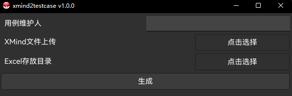

<h1 align="center">xmind2testcase</h1>


[](https://github.com/dperfly/xmind2testcase/releases)

[](https://github.com/dperfly/xmind2testcase/issues)


`xmind2testcase`
是一个旨在帮助测试团队高效转换XMind思维导图中的测试用例至Excel表格的开源工具。该工具提供了简单的命令行工具（GUI模式须自行打包），使用户可以轻松地将XMind中的测试用例转换为Excel格式。通过`xmind2testcase`
测试团队可以更好地整合XMind思维导图的测试用例到他们的测试管理流程中，从而提升测试工作的效率和可追踪性。目前导出的Excel支持`PingCode`管理平台的用例批量导入。

## 一、编写Xmind测试用例规范


#### 说明：

1. 主模块：主模块即XMind的根节点，一般对应自己测试用例所属的模块或者项目名称。

2. 子模块(需求ID)：子模块可以有多个，每个子模块会和主模块拼接显示，例如：商品模块/虚拟商品，括号中的需求ID为选填内容，填写具体的PingCode需求编号，当导入生成的测试用例时会根据需求ID进行测试用例的关联，建议填写。

3. 分组(前置步骤)：此区域支持水平和垂直方向上添加多个可以有多个分组，测试用例会根据分组内容进行测试用例标题显示，括号中的前置步骤表示测试用例生成的前置步骤。最终会进行拼接作为测试用例的前置条件，为选填内容。

4. 验证点(Px)：严格要求以"验证" 作为开头，脚本会根据"验证"二字判断是否是测试用例的标题部分。括号中的内容表示测试用例的级别，默认为P2级别，支持p1到p4级别。

5. 测试步骤&期望结果：此区域是对测试用例每一个测试步骤对应每一步的预期结果，测试步骤与预期结果均为选填。

6. 括号支持中文和英文括号，需要成对出现。

## 二、示例&生成结果


#### 注：第一行是空行是PingCode格式要求

## 三、命令行版本

### 1.下载可执行文件 或 自行构建

构建命令行版本（`tag`包中已提供，可直接下载使用）

```shell
go mod tidy
cd cmd/shell
go build main.go
```

### 2.查看帮助文档

```shell
xmind2testcase.exe -h

Usage of C:\Users\dperfly\Desktop\xmind2testcase.exe:
  -f string
        XMind文件
  -n string
        用例编辑者姓名
  -o string
        保存路径,默认为XMind的目录
  -v    版本
```

### 3.生成测试用例

```shell
xmind2testcase.exe -f C:\Users\dperfly\Desktop\商品模块.xmind -n dperfly
```

## 四、GUI版本

#### 构建GUI版本（需根据自己的系统自行构建）

GUI模式样式：

  
运行方式：

```shell
cd cmd/gui
go run main.go
```

构建命令： 需安装fyne环境

```shell
cd shell/gui
fyne package
```

## 五、兼容性

作者测试的XMind版本：

```shell
1.xmind 10
2.xmind 8 update 9
```

其它版本未测试,如有问题提交ISSUES,并提供XMind版本及XMind文件。


## TODO
1.根据使用者反馈,支持生成更多Excel模板,从而导入对应的测试平台中。